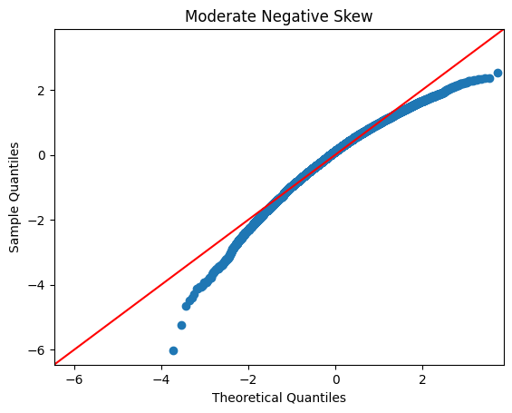

# Ex06 FEATURE TRANSFORMATION
## Aim:
To read the given data and perform Feature Transformation process and save the data to a file.
## Explanation:
Feature Transformation is a technique by which we can boost our model performance. Feature transformation is a mathematical transformation in which we apply a mathematical formula to a particular column(feature) and transform the values which are useful for our further analysis.
## Algorithm:
- Step1: Read the given Data.
- Step2: Clean the Data Set using Data Cleaning Process.
- Step3: Apply Feature Transformation techniques to all the features of the data set.
- Step4: Print the transformed features.
### Program:
```
Developed By: Anish Raj P
Register No: 212222230010
```
## Importing libraries and reading csv file:
  ```Python
  import numpy as np
  import pandas as pd
  import matplotlib.pyplot as plt
  import statsmodels.api as sm
  import scipy.stats as stats
  from sklearn.preprocessing import QuantileTransformer
  from sklearn.preprocessing import PowerTransformer
  df=pd.read_csv("Data_to_Transform.csv")
  ```
## Basic Information:
  ```Python
  df.head()
  df.info()
  df.describe()
  ```
  
  
  
  
## Before Transformation:
  ```Python
  sm.qqplot(df['Highly Positive Skew'],fit=True,line='45')
  plt.title("Highly Positive Skew")
  plt.show()

  sm.qqplot(df['Highly Negative Skew'],fit=True,line='45')
  plt.title("Highly Negative Skew")
  plt.show()

  sm.qqplot(df['Moderate Positive Skew'],fit=True,line='45')
  plt.title("Moderate Positive Skew")
  plt.show()

  sm.qqplot(df['Moderate Negative Skew'],fit=True,line='45')
  plt.title("Moderate Negative Skew")
  plt.show()
  ```
  
  
  
  


## Log Transformation:
  ```Python
  df['Highly Positive Skew'] = np.log(df['Highly Positive Skew'])
  sm.qqplot(df['Highly Positive Skew'],fit=True,line='45')
  plt.title("Highly Positive Skew")
  plt.show()
  
  df['Moderate Positive Skew'] = np.log(df['Moderate Positive Skew'])
  sm.qqplot(df['Moderate Positive Skew'],fit=True,line='45')
  plt.title("Moderate Positive Skew")
  plt.show()
  ```
  
  
  
## Reciprocal Transformation:
  ```Python
  df['Highly Positive Skew'] = 1/df['Highly Positive Skew']
  sm.qqplot(df['Highly Positive Skew'],fit=True,line='45')
  plt.title("Highly Positive Skew")
  plt.show()
  ```
  

## SquareRoot Transformation:
  ```Python
  df['Highly Positive Skew'] = df['Highly Positive Skew']**(1/1.2)
  sm.qqplot(df['Highly Positive Skew'],fit=True,line='45')
  plt.title("Highly Positive Skew")
  plt.show()
  ```
  

## Power Transformation:
  ```Python
  df['Moderate Positive Skew_1'], parameters=stats.yeojohnson(df['Moderate Positive Skew'])
  sm.qqplot(df['Moderate Positive Skew_1'],fit=True,line='45')
  plt.title("Moderate Positive Skew")
  plt.show()

  transformer=PowerTransformer("yeo-johnson")
  df['ModerateNegativeSkew_2']=pd.DataFrame(transformer.fit_transform(df[['Moderate Negative Skew']]))
  sm.qqplot(df['ModerateNegativeSkew_2'],fit=True,line='45')
  plt.title("Moderate Negative Skew")
  plt.show()
  ```
  
  

  
## Quantile Transformation:
  ```Python
  qt = QuantileTransformer(output_distribution = 'normal')
  df['ModerateNegativeSkew_2'] = pd.DataFrame(qt.fit_transform(df[['Moderate Negative Skew']]))
  sm.qqplot(df['ModerateNegativeSkew_2'],fit=True,line='45')
  plt.title("Moderate  Negative Skew")
  plt.show()
  ```
  

### Result:  
Thus feature transformation is done for the given dataset.
